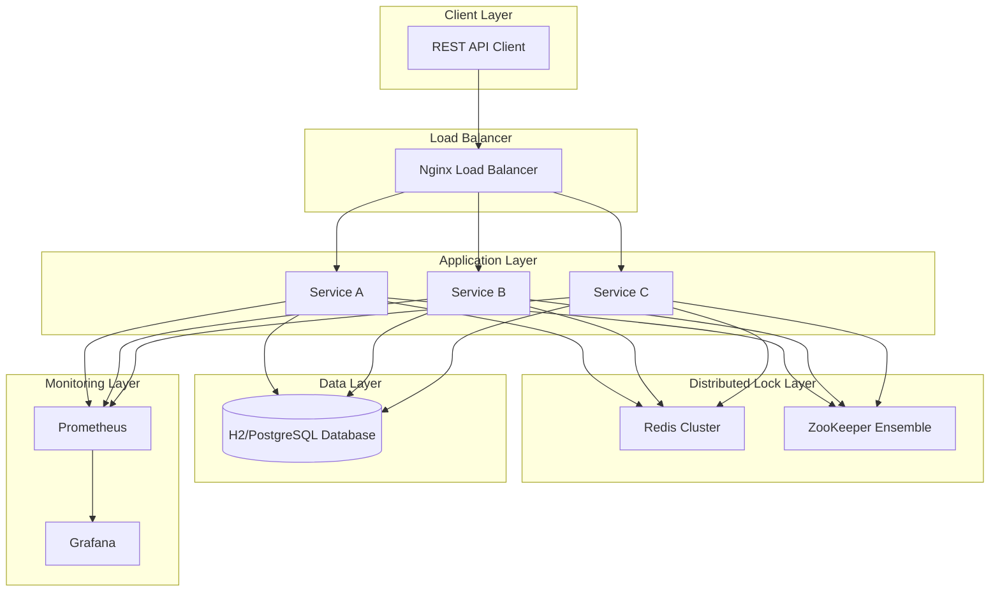

# 分散式鎖研究專案 (Distributed Lock Research) - 金融產業場景

[](https://openjdk.java.net/projects/jdk/21/)
[](https://spring.io/projects/spring-boot)
[](https://redis.io/)
[](https://zookeeper.apache.org/)
[](https://docs.docker.com/compose/)

## 專案概述

本專案是一個分散式鎖機制的研究和實作專案，使用 Java Spring Boot 21 框架，分別實現了基於 **Redis** 和 **ZooKeeper** 的分散式鎖解決方案。專案模擬銀行業務場景，特別是匯款和扣款等關鍵交易操作，以展示分散式鎖在確保資料一致性和防止併發問題方面的重要性。

### 主要特色

- 🔒 **雙重分散式鎖實作**: 支援 Redis (Redisson) 和 ZooKeeper (Apache Curator) 兩種分散式鎖提供者
- 🏦 **銀行交易模擬**: 提供真實的銀行業務場景，包括匯款、扣款和餘額查詢
- 🔄 **動態切換**: 支援運行時動態切換分散式鎖提供者
- 📊 **完整監控**: 集成 Prometheus 指標和 Spring Boot Actuator 健康檢查
- 🐳 **容器化部署**: 使用 Docker Compose 進行一鍵部署
- 📚 **完整文件**: 提供 Swagger UI API 文件和使用範例
- 🧪 **併發測試**: 內建併發測試工具，驗證分散式鎖的有效性

## 系統架構



## 快速開始

### 前置需求

- **Java 21** 或更高版本
- **Maven 3.8+**
- **Docker** 和 **Docker Compose**
- **Git**

### 1. Clone 專案

```bash
git clone https://github.com/example/distributed-lock-research.git
cd distributed-lock-research
```

### 2. 使用 Docker Compose 啟動（推薦）

```bash
# 啟動所有服務（Redis、ZooKeeper、應用程式、Nginx）
docker-compose up -d

# 查看服務狀態
docker-compose ps

# 查看應用程式日誌
docker-compose logs -f app
```

### 3. 本地開發模式

```bash
# 啟動 Redis 和 ZooKeeper
docker-compose up -d redis zookeeper

# 本地運行應用程式
mvn spring-boot:run -Dspring-boot.run.profiles=local
```

### 4. 驗證部署

訪問以下 URL 確認服務正常運行：

- **應用程式**: <http://localhost:8081/api>
- **Swagger UI**: <http://localhost:8081/api/swagger-ui/index.html>
- **API 文件**: <http://localhost:8081/api/api-docs>
- **健康檢查**: <http://localhost:8081/api/actuator/health>
- **Prometheus 指標**: <http://localhost:8081/api/actuator/prometheus>

> **注意**: 應用程式運行在 Docker 容器中，對外暴露端口為 8081，內部使用 8080。所有 API 端點都有 `/api` 前綴。

### 5. 快速測試

部署完成後，可以執行以下命令進行快速測試：

```bash
# 檢查應用程式健康狀態
curl http://localhost:8081/api/actuator/health

# 查詢示範帳戶餘額
curl http://localhost:8081/api/accounts/ACC001/balance

# 執行示範匯款
curl -X POST http://localhost:8081/api/transfer \
  -H "Content-Type: application/json" \
  -d '{"fromAccount":"ACC001","toAccount":"ACC002","amount":100}'
```

## API 使用指南

### API 文件

本專案提供完整的 Swagger UI API 文件，可以通過以下方式訪問：

- **Swagger UI**: <http://localhost:8081/api/swagger-ui/index.html>
- **OpenAPI JSON**: <http://localhost:8081/api/api-docs>

> **提示**: Swagger UI 提供了互動式的 API 測試介面，你可以直接在瀏覽器中測試所有 API 端點。

### 基本 API 端點

#### 1. 查詢帳戶餘額

```bash
curl -X GET "http://localhost:8081/api/accounts/ACC001/balance" \
     -H "accept: application/json"
```

**回應範例**:

```json
{
  "success": true,
  "message": "查詢成功",
  "data": {
    "accountNumber": "ACC001",
    "balance": 10000.00,
    "status": "ACTIVE"
  },
  "timestamp": "2024-01-01T12:00:00Z"
}
```

#### 2. 執行匯款操作

```bash
curl -X POST "http://localhost:8081/api/transfer" \
     -H "accept: application/json" \
     -H "Content-Type: application/json" \
     -d '{
       "fromAccount": "ACC001",
       "toAccount": "ACC002",
       "amount": 1000.00
     }'
```

**回應範例**:

```json
{
  "success": true,
  "message": "匯款成功",
  "data": {
    "transactionId": "TXN123456",
    "success": true,
    "message": "匯款完成",
    "fromAccount": "ACC001",
    "toAccount": "ACC002",
    "amount": 1000.00,
    "lockProvider": "redis"
  },
  "timestamp": "2024-01-01T12:00:00Z"
}
```

#### 3. 執行扣款操作

```bash
curl -X POST "http://localhost:8081/api/withdraw" \
     -H "accept: application/json" \
     -H "Content-Type: application/json" \
     -d '{
       "accountNumber": "ACC001",
       "amount": 500.00
     }'
```

### 分散式鎖管理 API

#### 1. 查看當前鎖狀態

```bash
curl -X GET "http://localhost:8081/api/lock-management/status" \
     -H "accept: application/json"
```

#### 2. 切換鎖提供者

```bash
# 切換到 ZooKeeper
curl -X POST "http://localhost:8081/api/lock-management/switch" \
     -H "accept: application/json" \
     -H "Content-Type: application/json" \
     -d '{
       "provider": "zookeeper"
     }'

# 切換到 Redis
curl -X POST "http://localhost:8081/api/lock-management/switch" \
     -H "accept: application/json" \
     -H "Content-Type: application/json" \
     -d '{
       "provider": "redis"
     }'
```

## 配置說明

### 環境變數配置

| 變數名稱 | 預設值 | 說明 |
|---------|--------|------|
| `SPRING_PROFILES_ACTIVE` | `docker,dev` | Spring 環境配置檔案 |
| `LOCK_PROVIDER` | `redis` | 分散式鎖提供者 (`redis` 或 `zookeeper`) |
| `REDIS_HOST` | `redis` | Redis 主機地址 |
| `REDIS_PORT` | `6379` | Redis 端口 |
| `ZK_HOST` | `zookeeper` | ZooKeeper 主機地址 |
| `ZK_PORT` | `2181` | ZooKeeper 端口 |
| `SERVER_PORT` | `8080` | 應用程式內部端口 |
| `INSTANCE_ID` | `app1` | 應用程式實例 ID |

### 應用程式配置檔案

- **`application.yml`**: 基礎配置
- **`application-local.yml`**: 本地開發環境配置
- **`application-docker.yml`**: Docker 環境配置
- **`application-prod.yml`**: 生產環境配置

### 示範資料

系統啟動時會自動初始化以下示範帳戶：

| 帳戶號碼 | 初始餘額 | 狀態 |
|---------|---------|------|
| ACC001 | 10,000.00 | ACTIVE |
| ACC002 | 20,000.00 | ACTIVE |
| ACC003 | 15,000.00 | ACTIVE |
| ACC004 | 5,000.00 | ACTIVE |
| ACC005 | 8,000.00 | ACTIVE |

## 監控和指標

### Spring Boot Actuator 端點

- **健康檢查**: <http://localhost:8081/api/actuator/health>
- **系統資訊**: <http://localhost:8081/api/actuator/info>
- **指標資料**: <http://localhost:8081/api/actuator/metrics>
- **Prometheus**: <http://localhost:8081/api/actuator/prometheus>
- **業務指標**: <http://localhost:8081/api/actuator/business-metrics>
- **系統資訊**: <http://localhost:8081/api/actuator/system-info>

### 自定義健康檢查

- **Redis 連接**: 檢查 Redis 連接狀態
- **ZooKeeper 連接**: 檢查 ZooKeeper 連接狀態
- **分散式鎖系統**: 檢查鎖系統整體健康狀態

### 業務指標

- 交易成功率
- 交易處理時間
- 鎖獲取成功率
- 鎖獲取延遲
- 併發度統計

## 開發指南

### 專案結構

```text
src/main/java/com/example/distributedlock/
├── config/                 # 配置類別
│   ├── DataInitializer.java
│   ├── LockConfiguration.java
│   ├── OpenApiConfig.java
│   └── ...
├── controllers/            # REST 控制器
│   ├── BankingController.java
│   └── LockManagementController.java
├── dto/                    # 資料傳輸物件
├── exception/              # 異常處理
├── factory/                # 工廠類別
├── health/                 # 健康檢查
├── lock/                   # 分散式鎖實作
│   ├── DistributedLock.java
│   ├── RedisDistributedLock.java
│   └── ZooKeeperDistributedLock.java
├── metrics/                # 指標收集
├── models/                 # 資料模型
├── repositories/           # 資料存取層
├── services/               # 業務邏輯層
└── validation/             # 資料驗證
```

### 本地開發

1. **啟動依賴服務**:
   ```bash
   docker-compose up -d redis zookeeper
   ```

2. **運行應用程式**:
   ```bash
   # 使用預設配置（端口 8080）
   mvn spring-boot:run -Dspring-boot.run.profiles=local
   
   # 或指定端口
   mvn spring-boot:run -Dspring-boot.run.profiles=local -Dserver.port=8080
   ```
   
   本地開發時，應用程式將運行在 <http://localhost:8080>，Swagger UI 可通過 <http://localhost:8080/swagger-ui/index.html> 訪問。

3. **運行測試**:
   ```bash
   mvn test
   ```

### 建構和部署

1. **建構 JAR 檔案**:
   ```bash
   mvn clean package
   ```

2. **建構 Docker 映像**:
   ```bash
   docker build -t distributed-lock-research:latest .
   ```

3. **使用建構腳本**:
   ```bash
   ./scripts/build-docker.sh
   ```

## 測試指南

本專案提供了完整的測試套件，包括單元測試、集成測試、併發測試和性能測試，確保分散式鎖機制在各種場景下的正確性和可靠性。

### 測試架構概覽

```text
測試層級架構
├── 單元測試 (Unit Tests)
│   ├── 服務層測試 (Service Layer)
│   ├── 控制器測試 (Controller Layer)
│   ├── 分散式鎖測試 (Lock Implementation)
│   └── 配置測試 (Configuration)
├── 集成測試 (Integration Tests)
│   ├── API 集成測試
│   ├── 資料庫集成測試
│   └── 系統集成測試
├── 併發測試 (Concurrency Tests)
│   ├── 分散式鎖併發驗證
│   ├── 多服務併發測試
│   └── 負載均衡測試
└── 性能測試 (Performance Tests)
    ├── 壓力測試
    ├── 負載測試
    └── 基準測試
```

### 1. 單元測試

#### 1.1 執行所有單元測試

```bash
# 執行所有測試
mvn test

# 執行特定測試類別
mvn test -Dtest=BankingServiceImplTest

# 執行測試並生成報告
mvn test jacoco:report
```

#### 1.2 主要測試類別

**服務層測試**：
- `BankingServiceImplTest` - 銀行業務邏輯測試
- `AccountServiceTest` - 帳戶管理服務測試
- `TransferServiceSimpleTest` - 轉帳服務測試
- `WithdrawalServiceTest` - 提款服務測試

**分散式鎖測試**：
- `RedisDistributedLockTest` - Redis 鎖功能測試
- `ZooKeeperDistributedLockSimpleTest` - ZooKeeper 鎖功能測試
- `RedisDistributedLockConcurrencyTest` - Redis 鎖併發測試

**控制器測試**：
- `BankingControllerTest` - 銀行 API 控制器測試
- `LockManagementControllerTest` - 鎖管理 API 測試

#### 1.3 測試配置

```bash
# 使用測試配置檔案
mvn test -Dspring.profiles.active=test

# 啟用測試容器
mvn test -Dspring.profiles.active=test,testcontainers
```

### 2. 集成測試

#### 2.1 執行集成測試

```bash
# 執行所有集成測試
mvn verify -P integration-tests

# 執行特定集成測試
mvn test -Dtest=SystemIntegrationTest
mvn test -Dtest=BankingApiIntegrationTest
```

#### 2.2 主要集成測試

**API 集成測試**：
```bash
# 測試完整的 API 流程
mvn test -Dtest=BankingApiIntegrationTest

# 測試併發場景
mvn test -Dtest=ConcurrencyVerificationTest
```

**系統集成測試**：
```bash
# 測試整個系統集成
mvn test -Dtest=SystemIntegrationTest

# 測試 Docker 部署
mvn test -Dtest=DockerDeploymentTest
```

#### 2.3 TestContainers 集成測試

專案使用 TestContainers 進行真實環境測試：

```bash
# 啟動 TestContainers 並執行測試
mvn test -Dspring.profiles.active=test,testcontainers

# 查看 TestContainers 日誌
docker logs $(docker ps -q --filter "label=org.testcontainers")
```

### 3. 併發測試

#### 3.1 快速併發測試

```bash
# 執行快速併發測試（推薦）
./scripts/quick-test.sh

# 查看測試說明
./scripts/quick-test.sh --help
```

**測試流程**：
1. 健康檢查 - 確認所有服務實例正常運行
2. 初始狀態檢查 - 獲取測試帳戶初始餘額
3. 併發轉帳測試 - 同時發送 15 個轉帳請求
4. 結果分析 - 統計成功/失敗次數
5. 資料一致性驗證 - 檢查金額守恆
6. 跨服務一致性檢查 - 確認所有服務餘額一致

#### 3.2 高併發壓力測試

```bash
# 執行高併發測試
./scripts/run-concurrent-tests.sh

# 自定義併發參數
CONCURRENT_REQUESTS=20 TRANSFER_AMOUNT=25.00 ./scripts/run-concurrent-tests.sh
```

**測試配置**：
- 預設併發請求數：每服務 10 個
- 測試服務：App1, App2, App3, LoadBalancer
- 轉帳金額：50.00 元
- 測試帳戶：ACC001 → ACC002

#### 3.3 Node.js 併發測試

```bash
# 安裝依賴
npm install newman axios

# 執行 Node.js 併發測試
node scripts/concurrent-test.js

# 查看詳細配置
cat scripts/concurrent-test.js | grep -A 20 "TEST_CONFIG"
```

#### 3.4 Postman 集合測試

```bash
# 使用 Newman 執行 Postman 集合
newman run postman/Distributed-Lock-Concurrent-Tests.postman_collection.json \
       -e postman/Distributed-Lock-Environment.postman_environment.json \
       -n 10 --delay-request 100

# 生成 HTML 報告
newman run postman/Distributed-Lock-Concurrent-Tests.postman_collection.json \
       -e postman/Distributed-Lock-Environment.postman_environment.json \
       -r htmlextra --reporter-htmlextra-export test-results/report.html
```

### 4. 性能測試

#### 4.1 API 性能基準測試

```bash
# 轉帳 API 性能測試
ab -n 1000 -c 10 -p transfer.json -T application/json \
   http://localhost:8081/api/transfer

# 餘額查詢性能測試
ab -n 1000 -c 10 http://localhost:8081/api/accounts/ACC001/balance

# 健康檢查性能測試
ab -n 1000 -c 20 http://localhost:8081/api/actuator/health
```

**transfer.json 範例**：
```json
{
  "fromAccount": "ACC001",
  "toAccount": "ACC002",
  "amount": 100.00
}
```

#### 4.2 負載測試

```bash
# 使用 wrk 進行負載測試
wrk -t12 -c400 -d30s --script=scripts/transfer.lua http://localhost:8080/api/transfer

# 使用 JMeter 進行負載測試
jmeter -n -t test-plans/distributed-lock-load-test.jmx -l test-results/load-test.jtl
```

#### 4.3 壓力測試

```bash
# 漸進式壓力測試
for i in {10..100..10}; do
  echo "Testing with $i concurrent users"
  ab -n 1000 -c $i http://localhost:8081/api/accounts/ACC001/balance
  sleep 5
done
```

### 5. 測試資料管理

#### 5.1 測試資料重置

```bash
# 重置測試帳戶餘額
./scripts/db-reset.sh reset-accounts

# 清除所有交易記錄
./scripts/db-reset.sh clear-transactions

# 完全重置為初始狀態
./scripts/db-reset.sh full-reset
```

#### 5.2 測試資料查詢

```bash
# 查看當前帳戶餘額
./scripts/db-reset.sh show-balances

# 查看最近交易記錄
./scripts/db-reset.sh show-transactions

# 查看完整系統狀態
./scripts/db-reset.sh show-all
```

#### 5.3 手動資料操作

```bash
# 直接 SQL 查詢
docker-compose exec postgres psql -U postgres -d distributed_lock -c \
  "SELECT account_number, balance FROM accounts WHERE account_number IN ('ACC001', 'ACC002');"

# 重置特定帳戶
docker-compose exec postgres psql -U postgres -d distributed_lock -c \
  "UPDATE accounts SET balance = 10000.00 WHERE account_number = 'ACC001';"
```

### 6. 測試結果分析

#### 6.1 測試報告位置

```bash
# 測試結果目錄
ls -la test-results/
├── concurrent-test-20250808-*.log      # 併發測試日誌
├── newman-App*-*.json                  # Newman 測試結果
├── test-report.txt                     # 測試摘要報告
├── transfer-results.csv                # 轉帳請求詳細記錄
└── concurrent-test-summary-*.json      # 詳細測試結果
```

#### 6.2 關鍵指標分析

**成功指標**：
- ✅ **資料一致性**：所有服務顯示相同的帳戶餘額
- ✅ **總金額守恆**：轉出金額 = 轉入金額
- ✅ **無重複轉帳**：併發請求不會導致重複處理
- ✅ **響應時間合理**：平均響應時間 < 5 秒
- ✅ **錯誤率低**：成功率 > 95%

**失敗指標**：
- ❌ **資料不一致**：不同服務顯示不同餘額
- ❌ **金額不守恆**：總金額發生變化
- ❌ **重複轉帳**：同一請求被處理多次
- ❌ **響應超時**：請求響應時間過長
- ❌ **高錯誤率**：成功率 < 90%

#### 6.3 性能基準

**預期性能指標**：
- 單次轉帳響應時間：< 2 秒
- 併發 10 個請求：< 5 秒完成
- 餘額查詢響應時間：< 500ms
- 系統吞吐量：> 100 TPS
- 錯誤率：< 1%

### 7. 測試環境配置

#### 7.1 本地測試環境

```bash
# 啟動測試依賴
docker-compose up -d redis zookeeper postgres

# 使用測試配置運行應用
mvn spring-boot:run -Dspring-boot.run.profiles=local,test
```

#### 7.2 Docker 測試環境

```bash
# 啟動完整測試環境
docker-compose up -d

# 等待服務就緒
./scripts/wait-for-services.sh

# 執行測試
./scripts/quick-test.sh
```

#### 7.3 CI/CD 測試環境

```bash
# GitHub Actions 測試命令
mvn clean test -Dspring.profiles.active=ci,testcontainers

# Jenkins 測試命令
mvn clean verify -P integration-tests,performance-tests
```

### 8. 故障排除

#### 8.1 常見測試問題

**測試失敗**：
```bash
# 檢查服務狀態
docker-compose ps

# 查看應用日誌
docker-compose logs app1

# 檢查資料庫連接
docker-compose exec postgres pg_isready -U postgres
```

**併發測試異常**：
```bash
# 檢查分散式鎖狀態
curl http://localhost:8081/api/lock-management/status

# 重置測試資料
./scripts/db-reset.sh full-reset

# 重新啟動服務
docker-compose restart app1 app2 app3
```

#### 8.2 測試調試

```bash
# 啟用詳細日誌
export SPRING_PROFILES_ACTIVE=test,debug
mvn test -Dlogging.level.com.example.distributedlock=DEBUG

# 單步調試特定測試
mvn test -Dtest=BankingServiceImplTest -Dmaven.surefire.debug
```

#### 8.3 性能調優

```bash
# 調整 JVM 參數
export MAVEN_OPTS="-Xmx2g -XX:+UseG1GC"

# 調整測試並行度
mvn test -Djunit.jupiter.execution.parallel.enabled=true \
         -Djunit.jupiter.execution.parallel.mode.default=concurrent
```

### 9. 持續集成測試

#### 9.1 自動化測試流程

```yaml
# .github/workflows/test.yml 範例
name: Automated Tests
on: [push, pull_request]
jobs:
  test:
    runs-on: ubuntu-latest
    steps:
      - uses: actions/checkout@v2
      - name: Setup Java
        uses: actions/setup-java@v2
        with:
          java-version: '21'
      - name: Run Unit Tests
        run: mvn test
      - name: Run Integration Tests
        run: mvn verify -P integration-tests
      - name: Run Concurrent Tests
        run: ./scripts/quick-test.sh
```

#### 9.2 測試報告集成

```bash
# 生成測試覆蓋率報告
mvn jacoco:report

# 生成 Surefire 報告
mvn surefire-report:report

# 整合所有報告
mvn site
```

### 10. 測試最佳實踐

#### 10.1 測試策略

1. **測試金字塔**：70% 單元測試，20% 集成測試，10% E2E 測試
2. **快速反饋**：單元測試 < 30 秒，集成測試 < 5 分鐘
3. **隔離性**：每個測試獨立，不依賴其他測試
4. **可重複性**：測試結果一致，不受環境影響

#### 10.2 測試命名規範

```java
// 測試方法命名：should_ExpectedBehavior_When_StateUnderTest
@Test
void should_TransferMoney_When_SufficientBalance() { }

@Test
void should_ThrowException_When_InsufficientBalance() { }

@Test
void should_PreventConcurrentTransfers_When_UsingDistributedLock() { }
```

#### 10.3 測試資料管理

```java
// 使用 @Transactional 確保測試隔離
@Test
@Transactional
@Rollback
void testTransferWithRollback() { }

// 使用 TestContainers 確保環境一致性
@Testcontainers
class IntegrationTest {
    @Container
    static PostgreSQLContainer<?> postgres = new PostgreSQLContainer<>("postgres:16");
}
```

## 故障排除

### 常見問題

1. **Redis 連接失敗**:
   - 檢查 Redis 服務是否正常運行
   - 確認 `REDIS_HOST` 和 `REDIS_PORT` 配置正確

2. **ZooKeeper 連接失敗**:
   - 檢查 ZooKeeper 服務是否正常運行
   - 確認 `ZK_CONNECT` 配置正確

3. **應用程式啟動失敗**:
   - 檢查 Java 版本是否為 21 或更高
   - 確認端口 8081 未被佔用

4. **Swagger UI 無法訪問**:
   - 確認使用正確的 URL: <http://localhost:8081/api/swagger-ui/index.html>
   - 注意應用程式有 `/api` 上下文路徑
   - 如果看到 404 錯誤，請檢查應用程式是否完全啟動完成

### 日誌查看

```bash
# 查看應用程式日誌
docker-compose logs -f app

# 查看 Redis 日誌
docker-compose logs -f redis

# 查看 ZooKeeper 日誌
docker-compose logs -f zookeeper
```

## 資料庫操作命令參考

### 基本連接語法

```bash
# 基本格式
docker-compose exec postgres psql -U postgres -d distributed_lock -c "SQL_COMMAND"

# 互動模式
docker-compose exec postgres psql -U postgres -d distributed_lock
```

### 帳戶管理

#### 查看帳戶餘額

```sql
-- 查看所有帳戶
SELECT account_number, balance, status, updated_at FROM accounts ORDER BY account_number;

-- 查看特定帳戶
SELECT * FROM accounts WHERE account_number = 'ACC001';

-- 查看多個特定帳戶
SELECT * FROM accounts WHERE account_number IN ('ACC001', 'ACC002');
```

#### 更新帳戶餘額

```sql
-- 重置單個帳戶
UPDATE accounts SET balance = 10000.00, updated_at = CURRENT_TIMESTAMP WHERE account_number = 'ACC001';

-- 重置多個帳戶
UPDATE accounts SET balance = CASE 
    WHEN account_number = 'ACC001' THEN 10000.00
    WHEN account_number = 'ACC002' THEN 20000.00
    ELSE balance
END, updated_at = CURRENT_TIMESTAMP 
WHERE account_number IN ('ACC001', 'ACC002');

-- 批量調整餘額
UPDATE accounts SET balance = balance + 1000.00 WHERE account_number LIKE 'ACC%';
```

#### 帳戶統計

```sql
-- 帳戶總數
SELECT COUNT(*) as total_accounts FROM accounts;

-- 各狀態帳戶統計
SELECT status, COUNT(*) as count FROM accounts GROUP BY status;

-- 餘額統計
SELECT 
    MIN(balance) as min_balance,
    MAX(balance) as max_balance,
    AVG(balance) as avg_balance,
    SUM(balance) as total_balance
FROM accounts;
```

### 交易管理

#### 查看交易記錄

```sql
-- 最近交易
SELECT transaction_id, from_account, to_account, amount, status, lock_provider, created_at 
FROM transactions 
ORDER BY created_at DESC 
LIMIT 20;

-- 特定帳戶的交易
SELECT * FROM transactions 
WHERE from_account = 'ACC001' OR to_account = 'ACC001'
ORDER BY created_at DESC;

-- 特定時間範圍的交易
SELECT * FROM transactions 
WHERE created_at > NOW() - INTERVAL '1 hour'
ORDER BY created_at DESC;

-- 失敗的交易
SELECT * FROM transactions 
WHERE status = 'FAILED'
ORDER BY created_at DESC;
```

#### 交易統計

```sql
-- 交易狀態統計
SELECT status, COUNT(*) as count FROM transactions GROUP BY status;

-- 鎖提供者統計
SELECT lock_provider, COUNT(*) as count 
FROM transactions 
WHERE lock_provider IS NOT NULL 
GROUP BY lock_provider;

-- 每小時交易量
SELECT 
    DATE_TRUNC('hour', created_at) as hour,
    COUNT(*) as transaction_count,
    COUNT(CASE WHEN status = 'COMPLETED' THEN 1 END) as successful,
    COUNT(CASE WHEN status = 'FAILED' THEN 1 END) as failed
FROM transactions 
WHERE created_at > NOW() - INTERVAL '24 hours'
GROUP BY hour 
ORDER BY hour DESC;

-- 交易金額統計
SELECT 
    COUNT(*) as total_transactions,
    SUM(amount) as total_amount,
    AVG(amount) as avg_amount,
    MIN(amount) as min_amount,
    MAX(amount) as max_amount
FROM transactions 
WHERE status = 'COMPLETED';
```

#### 清理交易資料

```sql
-- 刪除所有交易記錄 (危險操作!)
DELETE FROM transactions;

-- 刪除舊交易記錄
DELETE FROM transactions WHERE created_at < NOW() - INTERVAL '7 days';

-- 刪除失敗的交易記錄
DELETE FROM transactions WHERE status = 'FAILED';
```

### 資料重置

#### 完全重置為初始狀態

```sql
-- 1. 清除所有交易
DELETE FROM transactions;

-- 2. 重置帳戶餘額
UPDATE accounts SET 
    balance = CASE 
        WHEN account_number = 'ACC001' THEN 10000.00
        WHEN account_number = 'ACC002' THEN 20000.00
        WHEN account_number = 'ACC003' THEN 15000.00
        WHEN account_number = 'ACC004' THEN 5000.00
        WHEN account_number = 'ACC005' THEN 8000.00
        ELSE balance
    END,
    updated_at = CURRENT_TIMESTAMP,
    version = 0
WHERE account_number IN ('ACC001', 'ACC002', 'ACC003', 'ACC004', 'ACC005');
```

### 系統診斷

#### 檢查資料一致性

```sql
-- 檢查是否有負餘額
SELECT * FROM accounts WHERE balance < 0;

-- 檢查交易金額與帳戶餘額的一致性（簡單版本）
WITH account_changes AS (
    SELECT 
        from_account as account,
        -SUM(amount) as change
    FROM transactions 
    WHERE status = 'COMPLETED' AND from_account IS NOT NULL
    GROUP BY from_account
    
    UNION ALL
    
    SELECT 
        to_account as account,
        SUM(amount) as change
    FROM transactions 
    WHERE status = 'COMPLETED' AND to_account IS NOT NULL
    GROUP BY to_account
)
SELECT 
    a.account_number,
    a.balance as current_balance,
    10000.00 + COALESCE(SUM(ac.change), 0) as expected_balance
FROM accounts a
LEFT JOIN account_changes ac ON a.account_number = ac.account
WHERE a.account_number IN ('ACC001', 'ACC002')
GROUP BY a.account_number, a.balance;
```

#### 效能監控

```sql
-- 每分鐘交易統計
SELECT 
    DATE_TRUNC('minute', created_at) as minute,
    COUNT(*) as transactions,
    COUNT(CASE WHEN status = 'COMPLETED' THEN 1 END) as successful,
    AVG(EXTRACT(EPOCH FROM (updated_at - created_at))) as avg_duration_seconds
FROM transactions 
WHERE created_at > NOW() - INTERVAL '1 hour'
GROUP BY minute 
ORDER BY minute DESC;
```

### 快速命令

```bash
# 使用腳本
./scripts/db-reset.sh reset-accounts     # 重置 ACC001, ACC002 餘額
./scripts/db-reset.sh show-balances      # 顯示所有餘額
./scripts/db-reset.sh show-transactions  # 顯示最近交易
./scripts/db-reset.sh show-all          # 顯示完整狀態

# 直接 SQL
docker-compose exec postgres psql -U postgres -d distributed_lock -c "SELECT account_number, balance FROM accounts WHERE account_number IN ('ACC001', 'ACC002');"
```


## 參考

- [Spring Boot](https://spring.io/projects/spring-boot) - 應用程式框架
- [Redisson](https://redisson.org/) - Redis Java 客戶端
- [Apache Curator](https://curator.apache.org/) - ZooKeeper 客戶端
- [SpringDoc OpenAPI](https://springdoc.org/) - API 文件生成
- [Micrometer](https://micrometer.io/) - 指標收集框架