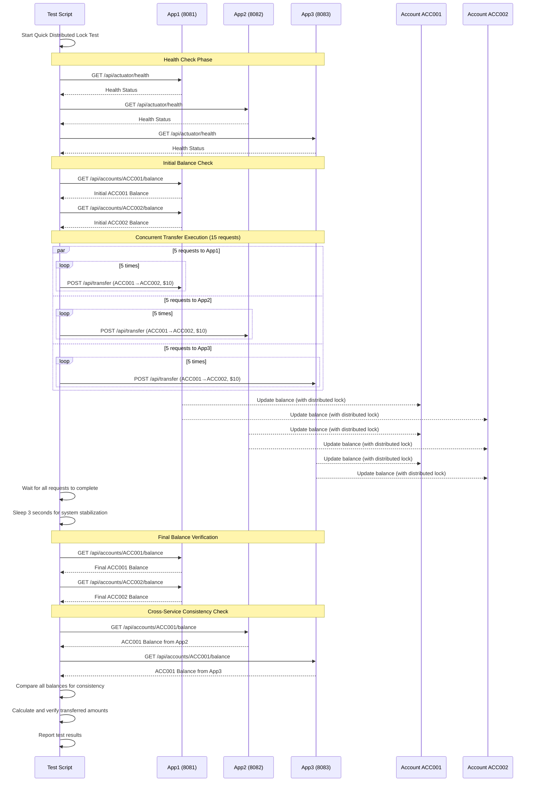

# Quick Test Sequence Diagram

This diagram shows the flow of the distributed lock testing process based on `scripts/quick-test.sh`.

## Test Flow Description

1. **Health Check Phase**: Verifies all three application instances are running and responsive
2. **Initial Balance Retrieval**: Gets starting balances for accounts ACC001 and ACC002
3. **Concurrent Transfer Execution**: Sends 15 parallel transfer requests (5 to each service instance)
4. **System Stabilization**: Waits for all operations to complete and system to stabilize
5. **Final Balance Verification**: Retrieves final balances after all transfers
6. **Cross-Service Consistency Check**: Verifies all services show consistent account balances
7. **Result Analysis**: Calculates transferred amounts and validates distributed lock effectiveness